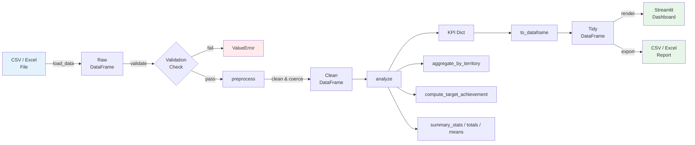

# Pharma Sales Dashboard

Analytical engine for pharmaceutical field-team sales data -- loads CSV/Excel files, validates structure, computes KPIs (target achievement, territory rollups, market share), and returns tidy results ready for Streamlit or any downstream visualization.

## Features

- **Data ingestion** from CSV and Excel (.xlsx / .xls)
- **Automated validation** with configurable required-column checks
- **Preprocessing pipeline** -- coerces types, fills missing numerics, strips whitespace (all immutable)
- **KPI computation** -- target achievement %, revenue, market share
- **Territory aggregation** with achievement scoring
- **Time-series filtering** by year and/or month (case-insensitive)
- **Tidy export** via `to_dataframe()` for downstream use
- **Sample data generator** for quick demos and load testing
- **49-test pytest suite** with edge-case coverage

## Quick Start

```bash
# Clone the repo
git clone https://github.com/achmadnaufal/pharma-sales-dashboard.git
cd pharma-sales-dashboard

# Create a virtual environment and install dependencies
python -m venv .venv
source .venv/bin/activate
pip install -r requirements.txt

# Run the example script
python examples/basic_usage.py
```

## Usage

### Run the example script

```bash
python examples/basic_usage.py
```

**Output:**

```
Sample data: 200 rows, 7 columns

=== Analysis Results ===
Total records: 200
Totals:
  territory: 19,108.25
  product: 20,970.92
  month: 20,963.12
  actual_units: 20,346.21
  target_units: 20,414.30
Means:
  territory: 95.541
  product: 104.855
  month: 104.816
  actual_units: 101.731
  target_units: 102.072
```

### Analyze the bundled sample data

```python
from src.main import PharmaSalesDashboard

dashboard = PharmaSalesDashboard()
result = dashboard.run("demo/sample_data.csv")
```

**Output:**

```
=== Pharma Sales Dashboard ===
Total records: 20
Columns: ['rep_id', 'rep_name', 'territory', 'product_name', 'therapeutic_area',
          'month', 'year', 'units_sold', 'revenue_usd', 'target_units',
          'calls_made', 'hcp_met', 'market_share_pct']

--- Totals ---
  units_sold: 2,566.00
  revenue_usd: 1,549,300.00
  target_units: 2,510.00
  calls_made: 1,056.00
  hcp_met: 755.00

--- Means ---
  units_sold: 128.300
  revenue_usd: 77,465.000
  target_units: 125.500
  calls_made: 52.800
  hcp_met: 37.750

--- Territory Summary ---
  Midwest:   524 units, $318,900 rev, 100.77% achievement
  Northeast: 450 units, $317,300 rev, 104.65% achievement
  Southeast: 494 units, $293,900 rev,  99.80% achievement
  Southwest: 536 units, $300,000 rev, 102.10% achievement
  West:      562 units, $319,200 rev, 104.07% achievement

--- Target Achievement (per row) ---
  Min: 89.09%  Max: 119.23%  Avg: 100.3%
```

### Generate synthetic data

```bash
python src/data_generator.py
```

```
Generated 300 records -> data/sample.csv
Shape: (300, 7)
Columns: ['rep_id', 'territory', 'product', 'month', 'actual_units', 'target_units', 'revenue_usd']
```

### Run the test suite

```bash
pytest tests/ -v
```

```
tests/test_dashboard.py::TestComputeRevenue::test_basic_revenue_calculation PASSED
tests/test_dashboard.py::TestComputeTargetAchievement::test_zero_target_returns_zero PASSED
tests/test_dashboard.py::TestAggregateByTerritory::test_returns_one_row_per_territory PASSED
tests/test_dashboard.py::TestFilterTimeSeries::test_filter_by_year PASSED
tests/test_dashboard.py::TestEdgeCases::test_all_zero_targets_in_analysis PASSED
tests/test_dashboard.py::TestDashboardAnalyze::test_analyze_returns_required_keys PASSED
tests/test_dashboard.py::TestDashboardRunWithFile::test_run_with_sample_csv PASSED
...
49 passed in 0.25s
```

## Tech Stack

| Layer | Technology |
|-------|-----------|
| Language | Python 3.9+ |
| Data processing | pandas, NumPy |
| Visualization | Streamlit, Plotly |
| CLI formatting | Rich |
| Testing | pytest |

## Architecture



## Project Structure

```
pharma-sales-dashboard/
├── src/
│   ├── __init__.py
│   ├── main.py              # Core dashboard class and helper functions
│   └── data_generator.py    # Synthetic data generator
├── tests/
│   ├── __init__.py
│   └── test_dashboard.py    # 49-test pytest suite
├── demo/
│   └── sample_data.csv      # 20-row realistic sample dataset
├── sample_data/
│   └── sample_data.csv      # Compact 15-row sample for quick experiments
├── examples/
│   └── basic_usage.py       # Runnable usage example
├── data/                    # Working data directory (gitignored)
├── LICENSE
├── requirements.txt
├── .gitignore
├── CHANGELOG.md
└── README.md
```

## License

MIT License -- see [LICENSE](LICENSE) for details.

---

> Built by [Achmad Naufal](https://github.com/achmadnaufal) | Lead Data Analyst | Power BI · SQL · Python · GIS
