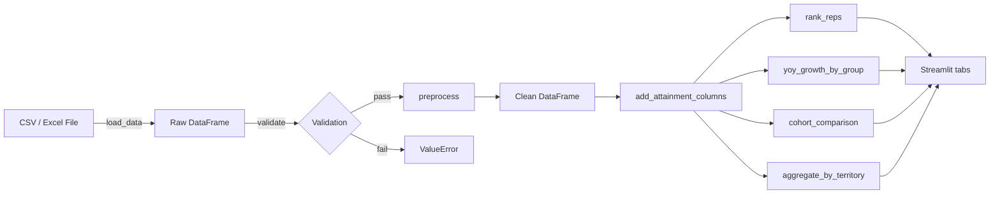

# Pharma Sales Dashboard

## Overview

Streamlit-powered business-intelligence dashboard for pharmaceutical field teams.  It ingests a sales CSV/Excel file produced by your CRM (call logs, prescriptions, revenue, targets) and surfaces the KPIs a pharma sales manager actually cares about:

- **Target attainment** against both unit and dollar targets
- **Rep leaderboards** with configurable ranking metric and top-N cut-off
- **Year-over-year (YoY) growth** at territory, rep, and product level
- **Cohort comparisons** between any two slices of the data (territories, products, therapeutic areas)
- **Period filtering** by individual month, multi-month selection, or calendar range
- **Call effectiveness** (revenue per call, HCP coverage)
- **Bass diffusion forecasting** for new-product launch uptake curves (p / q / m parameterization, closed-form peak timing, grid-search fitter)

The analytical core is a set of pure, immutable Python functions in `src/main.py`, `src/metrics.py`, and `src/bass_diffusion.py` - testable without a Streamlit runtime.  `src/streamlit_app.py` is a thin view layer on top of that core.

## Installation

Requires Python 3.9 or newer.

```bash
git clone https://github.com/achmadnaufal/pharma-sales-dashboard.git
cd pharma-sales-dashboard

python -m venv .venv
source .venv/bin/activate           # Windows: .venv\Scripts\activate

pip install -r requirements.txt
```

## Running the Dashboard

Launch the Streamlit app against the bundled demo file:

```bash
streamlit run src/streamlit_app.py
```

Streamlit opens a browser at `http://localhost:8501`.  Use the sidebar to upload your own `.csv` / `.xlsx` file; if nothing is uploaded, `demo/sample_data.csv` is loaded automatically.

For a non-UI smoke test:

```bash
python examples/basic_usage.py
```

## Step-by-Step Usage

1. **Prepare your data** - a CSV/Excel file with the schema described in [Data Schema](#data-schema).  Column names can be in mixed case; the preprocessing pipeline normalizes them to snake_case.
2. **Launch the app** with `streamlit run src/streamlit_app.py`.
3. **Upload the file** via the sidebar *Upload sales CSV* picker, or leave blank to use the demo data.
4. **Filter by month** in the sidebar multiselect - the selection cascades to every tab.
5. **Navigate the tabs** (see [Sections / Tabs](#sections--tabs)).
6. **Export or drill-down** - the underlying DataFrames render in interactive tables you can sort, resize, and download.
7. **Automate** by importing `PharmaSalesDashboard` or the functions in `src.metrics` directly in a notebook or ETL job.

```python
from src.main import PharmaSalesDashboard
from src.metrics import rank_reps, yoy_growth_by_group

dashboard = PharmaSalesDashboard()
df = dashboard.preprocess(dashboard.load_data("demo/sample_data.csv"))

top5 = rank_reps(df, metric="revenue_usd", top_n=5)
yoy = yoy_growth_by_group(df, group_column="territory")
```

## Sections / Tabs

The Streamlit app has four tabs, all driven by the same filtered DataFrame:

| Tab                  | What it shows                                                                                   |
|----------------------|-------------------------------------------------------------------------------------------------|
| **Overview**         | Headline metrics (total revenue, total units, unit attainment) and a territory summary table.  |
| **Rep Leaderboard**  | Reps ranked by revenue, units, or calls.  Top-N slider and metric switcher.                    |
| **YoY Growth**       | Current-year vs prior-year revenue per territory / product / rep with growth %.                |
| **Cohort Comparison**| Side-by-side totals, delta, and delta-% for any two cohort values (e.g., Northeast vs West).   |

## Data Schema

Core columns the app understands.  Any missing column is skipped gracefully - the dashboard degrades rather than crashing.

| Column                | Type    | Required | Description                                             |
|-----------------------|---------|----------|---------------------------------------------------------|
| `rep_id`              | string  | required | Unique rep identifier                                   |
| `rep_name`            | string  | optional | Display name for leaderboards                           |
| `territory`           | string  | required | Territory the rep covers                                |
| `region`              | string  | optional | Higher-level region grouping                            |
| `product_name`        | string  | required | SKU or brand                                            |
| `therapeutic_area`    | string  | optional | Therapy class (Cardiology, Oncology, ...)               |
| `month`               | string  | required | Full month name (case-insensitive)                      |
| `year`                | int     | required | Four-digit calendar year                                |
| `units_sold`          | float   | required | Units sold in the period                                |
| `revenue_usd`         | float   | required | Revenue booked in USD                                   |
| `target_units`        | float   | required | Period unit target                                      |
| `target_revenue_usd`  | float   | optional | Period revenue target - enables revenue attainment KPI  |
| `calls_made`          | int     | optional | Sales calls completed                                   |
| `calls_target`        | int     | optional | Sales-call target - enables call attainment KPI         |
| `hcp_met`             | int     | optional | Unique HCPs met                                         |
| `new_prescribers`     | int     | optional | First-time prescribers acquired in period               |
| `market_share_pct`    | float   | optional | Product market share                                    |

A fully-populated 20-row example lives in [`demo/sample_data.csv`](demo/sample_data.csv).

## Forecast a new-product launch with the Bass diffusion model

The `bass_diffusion` module implements the classic Bass (1969) new-product
uptake model, widely used in pharma launch analytics. Supply the coefficient
of innovation `p`, coefficient of imitation `q`, and the market potential
`m`, then project cumulative and new adopters period-by-period.

```python
from src.bass_diffusion import BassParameters, forecast, peak_period

params = BassParameters(p=0.01, q=0.4, m=12000, product_name="Cardivex 10mg")
fc = forecast(params, horizon=24)

print(fc.to_dataframe().head())
print(f"Continuous-time peak month: {peak_period(params):.2f}")
```

**Output:**

```
   period  cumulative_adopters  new_adopters  adoption_fraction
0       1           127.624834    127.624834           0.010635
1       2           314.103920    186.479086           0.026175
2       3           585.120081    271.016161           0.048760
3       4           976.003793    390.883712           0.081334
4       5          1534.126181    558.122388           0.127844
Continuous-time peak month: 9.00
```

A grid-search fitter (`fit_parameters`) recovers `p` and `q` from observed
launch data without requiring SciPy, and `forecast_from_launch_row` lets
you batch-forecast a portfolio from a tabular launch plan
(see `sample_data/bass_diffusion_samples.csv`).

## Running the Test Suite

```bash
pytest tests/ -v
```

131 tests across three modules cover every pure function and its edge cases (empty DataFrame, zero / negative / NaN target, missing columns, ties, and more):

- `tests/test_dashboard.py`       - 49 tests for `src.main`
- `tests/test_metrics.py`         - 39 tests for `src.metrics`
- `tests/test_bass_diffusion.py`  - 43 tests for `src.bass_diffusion`

## Project Structure

```
pharma-sales-dashboard/
| src/
|   | __init__.py
|   | main.py              # Core dashboard class + validation / preprocess
|   | metrics.py           # Attainment, YoY, ranking, cohort helpers
|   | bass_diffusion.py    # Bass (1969) new-product uptake forecaster
|   | streamlit_app.py     # Streamlit UI (4 tabs)
|   | data_generator.py    # Synthetic data generator
| tests/
|   | test_dashboard.py        # 49-test suite
|   | test_metrics.py          # 39-test suite
|   | test_bass_diffusion.py   # 43-test suite
| demo/
|   | sample_data.csv      # 20-row realistic sample (2024 + 2025)
| sample_data/
|   | sample_data.csv              # Compact sample for quick experiments
|   | bass_diffusion_samples.csv   # Launch-plan rows with p, q, m, therapeutic area
| examples/
|   | basic_usage.py
| data/                    # Working dir (gitignored)
| LICENSE
| requirements.txt
| .gitignore
| CHANGELOG.md
| README.md
```

## Architecture



## Tech Stack

| Layer           | Technology           |
|-----------------|----------------------|
| Language        | Python 3.9+          |
| Data processing | pandas, NumPy        |
| UI              | Streamlit, Plotly    |
| Testing         | pytest               |

## License

MIT License - see [LICENSE](LICENSE) for details.

---

> Built by [Achmad Naufal](https://github.com/achmadnaufal) | Lead Data Analyst | Power BI, SQL, Python, GIS
